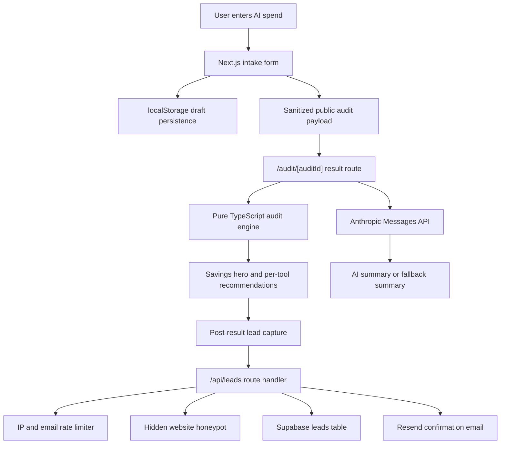

# SpendLens Architecture

SpendLens is built as a Next.js app with a deliberately small backend. The audit math is local and deterministic, while the only server-side state today is lead capture after a result is shown.

## Data Flow

The home page collects team size, primary use case, tool tier, monthly spend, and seat count. The form persists in `localStorage` so a founder can refresh the page without losing the audit.

When the user runs an audit, SpendLens creates a sanitized public payload. It includes only spend inputs: tools, plan tiers, seats, monthly spend, team size, and use case. It does not include email, company name, role, or any future lead fields. That payload is encoded into the share URL, which lets the result page be public and screenshot-friendly without needing a database record for every anonymous audit.

The result route decodes the payload, rebuilds a `SpendFormState`, and calls the pure TypeScript audit engine. The engine compares current spend against official pricing data and hardcoded rules. API spend is handled carefully: the app can flag it for usage review, but it does not invent savings without token-level evidence.

For the summary paragraph, the route calls Anthropic with the already-computed audit facts. If the API key is missing, the request fails, or the timeout is hit, the page falls back to a deterministic template. The page still renders and the recommendations still work.

Lead capture appears only after the result is shown. The `/api/leads` route validates input, checks the honeypot, applies rate limits, writes to Supabase with the service-role key, then sends a confirmation email through Resend. Email delivery status is written back to the lead row so failed or skipped sends are visible.

## Why This Stack

Next.js is the right default here because the assignment needs a polished UI, server-rendered share pages, API routes, metadata, and Vercel deployment without splitting the app into separate services.

TypeScript keeps the audit rules honest. The important money logic lives in typed pure functions with tests, not inside a prompt or a component.

Tailwind keeps the interface fast to build while still letting the product feel designed. SpendLens is an operational tool, so the UI stays restrained, dense, and readable instead of looking like a generic landing page.

Supabase is a pragmatic backend for this stage. We need a lead table, row-level security, simple inserts, and a path to Postgres reporting later. It is more than enough before the product has complex account state.

Resend is the simplest transactional email choice for a Vercel app. The implementation uses environment variables and a direct server-side call, so no API key ever reaches the browser.

Anthropic is used only for language, not for finance decisions. That boundary is intentional. If the model fails, the audit still works.

## What Changes At 10k Audits Per Day

Ten thousand audits per day is not huge for static pages, but it changes which parts should be trusted to memory and URL payloads.

First, public audits should move from encoded URL payloads to stored audit snapshots. A `public_audits` table would store the sanitized payload by ID, with a short public slug and no identifying lead fields. That gives smaller URLs, cleaner metadata, easier revocation, and better analytics.

Second, rate limiting should move out of process memory. The current in-memory guard is fine for a small launch, but a real Vercel deployment can run across regions and cold starts. Upstash Redis or Vercel KV would make IP and email limits consistent.

Third, AI summaries should be queued or cached. At 10k audits/day, calling Anthropic synchronously on every result view is wasteful. The app should cache summaries by audit hash and fall back immediately while a background job generates or refreshes the summary.

Fourth, lead capture should become event-driven. The route can still return quickly after the Supabase insert, but Resend sending and CRM enrichment should move to a queue so email or downstream failures do not slow the user path.

Fifth, pricing data should become a versioned table instead of a code constant. The current code is correct for a hiring assignment because every number is documented and tested. At scale, pricing updates need review history, effective dates, and an admin workflow.

Finally, observability becomes non-negotiable. I would add Vercel Web Analytics, server function logs, alerting on `/api/leads` error rate, and weekly reports for completed audits, lead capture rate, qualified savings rate, and accepted savings.

