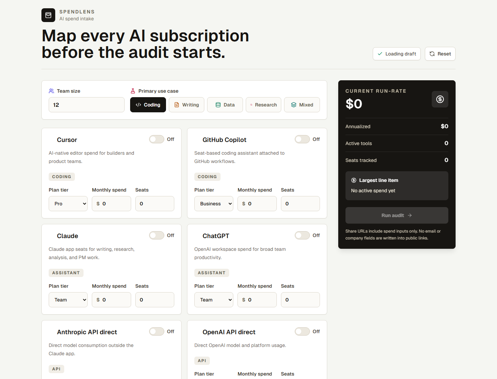
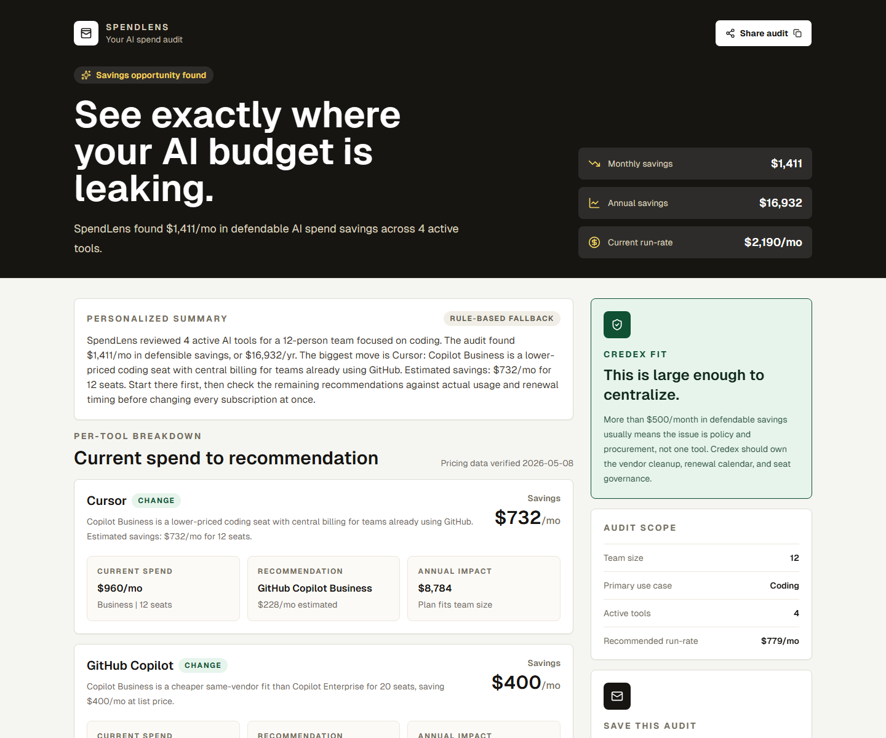
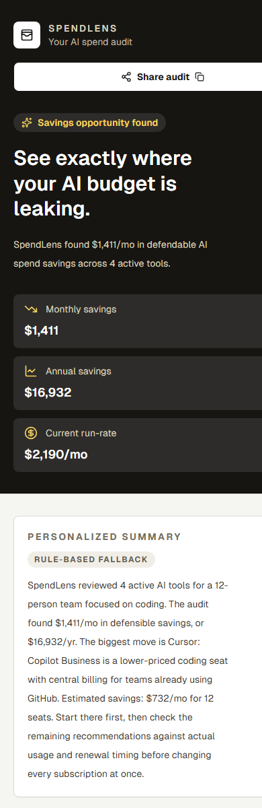

# SpendLens

A free AI spend audit tool that tells startup founders, engineering managers, and finance leads exactly where their AI tool budget is leaking. Enter your stack — Cursor, Copilot, Claude, ChatGPT, Gemini, Windsurf, and API usage — and get an instant audit with defensible savings math. No login, no paywall. You only see the option to save the report after the audit proves it's worth saving.

**Live:** [https://spendlens-nu.vercel.app](https://spendlens-nu.vercel.app)

---

## Screenshots


*Intake form — enter tools, plans, monthly spend, and seats*


*Audit results — savings hero, per-tool breakdown, Credex callout for large savings*


*Mobile audit results*

---

## What it does

**Round 1 — One-time audit.** User enters their AI tool stack, gets a per-tool breakdown of what to keep, downgrade, or switch, with savings math verified against vendor pricing pages.

**Round 2 — Re-audit on pricing change.** Saved audits are persisted with a frozen pricing snapshot. When tool pricing changes, SpendLens detects which audits are affected, emails users with a consolidated summary, and links them to a side-by-side diff view showing old vs new recommendations.

---

## Quick start

```bash
npm install
```

```bash
copy .env.example .env.local   # Windows
cp .env.example .env.local     # Mac/Linux
```

```bash
npm run dev
```

The app runs without Anthropic, Supabase, or Resend keys. The anonymous audit flow works fully. Anthropic falls back to a templated summary. Lead capture returns a clean 503 until Supabase variables are set.

**Run checks:**

```bash
npm run lint
npm test
npm run build
```

---

## Deploy

Push to Vercel. Set the environment variables below and run both Supabase migrations against your remote project:

```
supabase/migrations/202605100001_create_leads.sql
supabase/migrations/202605200001_create_stored_audits.sql
```

**Required environment variables:**

```
NEXT_PUBLIC_SUPABASE_URL=
NEXT_PUBLIC_SUPABASE_ANON_KEY=
SUPABASE_SERVICE_ROLE_KEY=
NEXT_PUBLIC_APP_URL=
ANTHROPIC_API_KEY=
ANTHROPIC_MODEL=
RESEND_API_KEY=
RESEND_FROM_EMAIL=
CRON_SECRET=              # optional — protects /api/detect-changes
```

---

## Architecture decisions

**Audit logic is hardcoded TypeScript, not AI.**
Finance recommendations need to be deterministic and testable. If the engine says "downgrade from Copilot Enterprise to Business and save $200/month," a finance person should be able to verify that against the vendor pricing page. A model can't be audited. Pure functions can. The Anthropic API is used only for the summary paragraph — polish, not math.

**Public audit URLs encode the spend snapshot instead of storing it.**
Storing anonymous company spend data before the user has agreed to anything breaks the product's core promise — show value first, ask for nothing until after. URL encoding is a real trade-off (longer links) but it keeps the anonymous flow completely offline and the result page renders from the URL with no backend read at all.

**Lead capture comes after the result, not before.**
Putting an email gate before the audit would kill trust. Finance people who land here from a tweet are already skeptical. The product earns the email by showing real savings first.

**API spend gets a usage-review flag, not a savings claim.**
It would be easy to claim huge savings by comparing an API bill to a cheaper app subscription. SpendLens doesn't do that. API spend is flagged for usage review — export token usage by model before making any recommendation.

**Re-audit only fires when the recommendation changes, not when a price moves.**
A $1 bump that doesn't shift the advice shouldn't trigger an email. The detection engine re-runs the full audit with current pricing and only flags tools where the actual recommendation differs.

---

## Lead capture and abuse controls

The lead form includes a hidden `website` field as a honeypot. Real users never see it or tab to it. When it has a value, the API returns 201 and quietly skips Supabase and Resend — no data written, no signal to the bot that anything happened.

The `/api/leads` route rate limits by IP (8 requests per 10 minutes) and by email (3 per 15 minutes). That's enough for a launch and handles the obvious abuse patterns without adding a CAPTCHA that would slow down real users.
